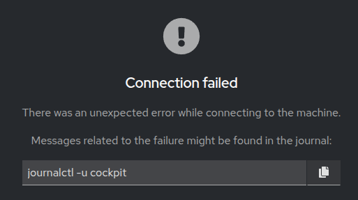

# How to enable Google Authenticator to Cockpit for Ubuntu
https://www.reddit.com/r/Ubuntu/comments/1cjkv3j/guide_how_to_enable_google_authenticator_to/?utm_source=share&utm_medium=web3x&utm_name=web3xcss&utm_term=1&utm_content=share_button

```
# install google auth
sudo apt-get install libpam-google-authenticator libqrencode-dev

# create qr codes that you can scan into your mobile // also make sure to save the scratch codes somewhere safe.
google-authenticator -t -d -f -r 3 -R 30 -W -Q UTF8

# Append the cockpit auth requirement
sudo bash -c 'echo "auth required pam_google_authenticator.so nullok" >> /etc/pam.d/cockpit'

# ((Complete the above before you run the below. ))
sudo systemctl restart cockpit
```

## Error/Fix - Connection failed when using https://cockpit.ajaydwivedi.com, but accessible on http://localhost:9090


```
# Enable cockpit-ws to trust proxied HTTPS headers
sudo loginctl enable-linger $USER

# Create/Edit /etc/cockpit/cockpit.conf

[WebService]
Origins = https://cockpit.ajaydwivedi.com
ProtocolHeader = X-Forwarded-Proto
ForwardedForHeader = X-Forwarded-For

# Restart cockpit
sudo systemctl restart cockpit

# Check logs
journalctl -u cockpit --no-pager --since "5 minutes ago"

```

## Install Google Authenticator App on Ubuntu Desktop & Import Tokens from GAuth
```
# Install gnome-authenticator for Ubuntu Desktop
sudo apt install gnome-authenticator

# Download executable binary from https://github.com/scito/extract_otp_secrets/releases
extract_otp_secrets_<release>_linux_x86_64
wget https://github.com/scito/extract_otp_secrets/releases/download/v2.11.0/extract_otp_secrets_2.11.0_linux_x86_64


# Make it execute
cd ~/Downloads/gauth
chmod +x extract_otp_secrets_<release>_linux_x86_64

# Export codes from Google Authenticator by taking screenshots, and download them in directory
cd ~/Downloads/gauth
1_4.jpeg  2_4.jpeg  3_4.jpeg  4_4.jpeg

# Extract them codes are json using ""
cd ~/Downloads/gauth
./extract_otp_secrets_2.11.0_linux_x86_64 \
    --json extracted_secrets.json \
    *.jpeg

# Method 01 (Preferred): Convert/Export the "extracted_secrets.json" into gnome-authenticator compatible JSON file
python ~/GitHub/Linux-Learning/Fresh-Linux-OS-Setup/convert_2fa_to_gnome_format.py \
    ~/Downloads/gauth/extracted_secrets.json

or

# Method 02: Now manually export the tokens. Open file "extracted_secrets.json"
Provider <-- GAuth
Provider Website <-- url
Account Name <-- name
2FA Token <-- secret


```
