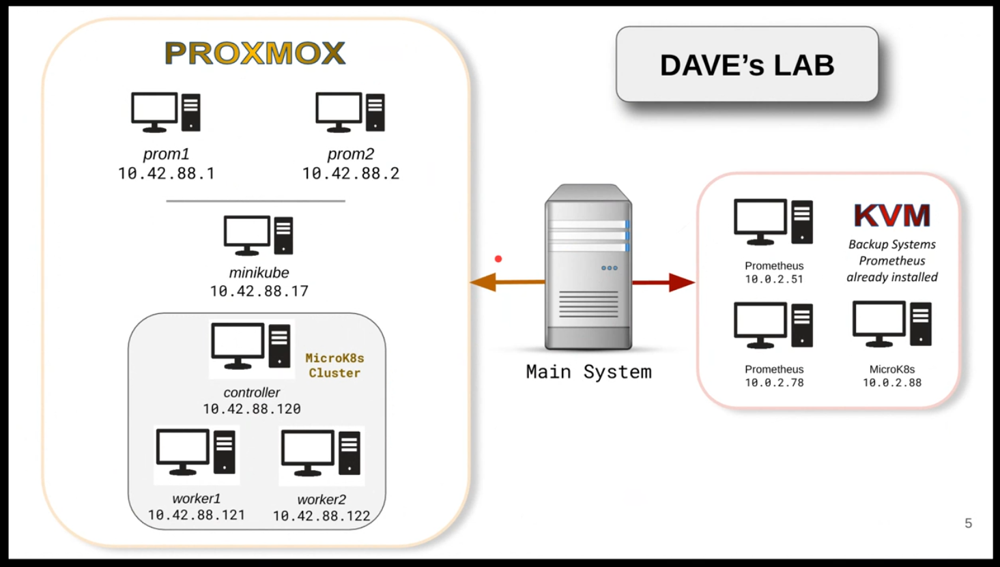
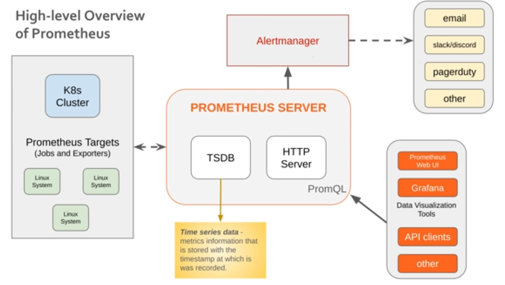

# Using Prometheus to Monitor Linux and Kubernetes



## What is Prometheus?

Prometheus is:

- A monitoring and alerting toolkit.
- Open source.
- Extensible with tools such as node_exporter, alertmanager, pg_exporter etc

## High-level Overview of Prometheus

Prometheus Server
- TSDB (Time Series Database)
- HTTP Server
- PromQL

Data Visualization
- Prometheus Web UI
- Grafana

Alert Manager
- Install on Prometheus server
- Notification/alert to email, slack, discord, pagerduty, others..

Prometheus Targets (Jobs and Exporters)
- Linux System
  - node_exporter install
- Database System
  - pg_exporter install
- Service Discovery

- Read data from API clients




## Prometheus Installation
```
# copy installation scripts to downloads directory
cp -r /stale-storage/Study-Zone/Monitoring\ Alerting\ Baselining/lab-01 ~/Downloads/

# switch to downloads
cd ~/Downloads/lab-01

# make it executable
chmod +x prometheus-install-v3.4.1.sh

# install
sudo ./prometheus-install-v3.4.1.sh

Note: To run Prometheus manually, do the following:
1. Stop the Prometheus service: 'sudo systemctl stop prometheus'
2. Run the prometheus command, for example: 'prometheus --config.file=/etc/prometheus/prometheus.yml'

```

